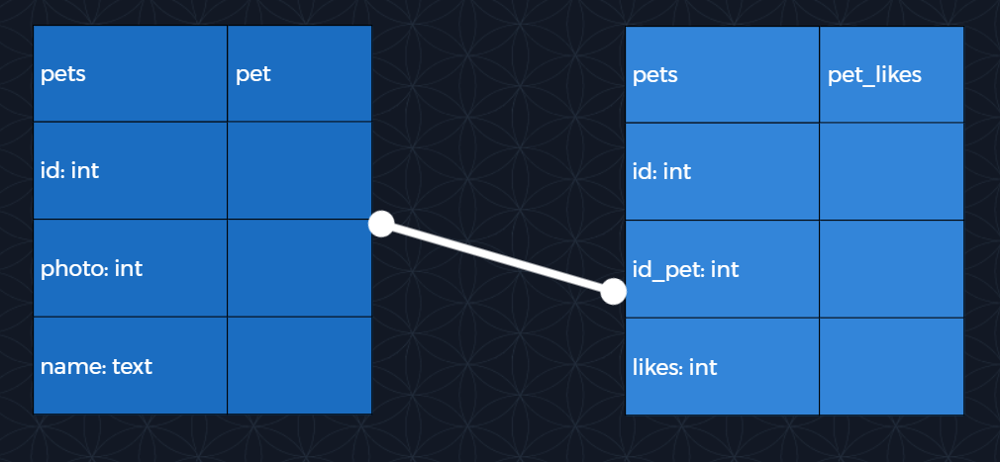

# MascotasPersistencia

App para calificar la generación de persistencia y el uso de las Bases de Datos.

Tarea para curso de Coursera "Desarrollo de aplicaciones con Android" semana 5.   
  
  
Para la creación de la base de datos se utilizó el siguiente modelo:  
---

  
  

  

  Aclaración:  

*Para que funcione el JavaMail (pre configurado para gmail) hay que reemplazar los valores email (por tu gmail) e email_password (por tu contraseña de gmail) en el archivo strings.xml y la línea 93 del archivo /app/src/main/java/com/gian/mascotasfinal/Contact.java por el o los destinatarios del email a enviar. También hay que permitir el acceso de aplicaciones
poco seguras a tu cuenta de Google desde aquí: https://www.google.com/settings/security/lesssecureapps*
  
  
  
  
  Fuentes:  
--
Partes del código (específicamente en la implementación de JavaMail) fueron obtenidas de las siguientes fuentes:  

https://github.com/angeles-ricardo-89/Petagram_-IntegrandoWebServices  

https://stackoverflow.com/questions/2020088/sending-email-in-android-using-javamail-api-without-using-the-default-built-in-a  
